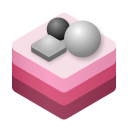

# Renzo



With **Renzo**, you can display and interact with three-dimensional
content in your Playdate app or game. Load scenes and models from files or
generated structures, and render them with various projection mechanisms.
Renzo also sports cross-platform capabilities through **RenzoCore**,
letting you display your models and scenes with other frameworks such as
RealityKit. Renzo also provides a companion extension for Blender that
allows you to create models and scenes designed for Renzo easily.

> **Warning**  
> Renzo is in a pre-release state. Features, capabilities, and API design
> are not finalized. Use at your own risk!

### Use cases

Renzo is designed for 3D content that relies on static camera shots,
similar to games such as _Alone in the Dark_, early _Resident Evil_ titles,
and _Lorelei and the Laser Eyes_. However, Renzo is capable of displaying
general 3D models and very basic use cases.

## Getting started

Start by adding `Renzo` to your package dependencies with the Swift
Package Manager:

```swift
dependencies: [
    .package(url: "https://source.marquiskurt.net/PDUniverse/Renzo.git", branch: "main")
]
```

Then, in your game's target, add the Renzo dependency:

```swift
targets: [
    .target(
        name: "MyGame",
        dependencies: [
            .product(name: "Renzo", package: "Renzo")
        ]
    )
]
```

### Using Renzo on non-Playdate targets

To use the cross-platform compatible code, replace the `Renzo` product name
with `RenzoCore`:

```swift
targets: [
    .target(
        name: "MyGame",
        dependencies: [
            .product(name: "RenzoCore", package: "Renzo")
        ]
    )
]
```

When adding Renzo dependencies to your project, you may also need to remove
the `Playdate` trait, which allows building for Embedded Swift:

```swift
dependencies: [
    .package(
        url: "https://source.marquiskurt.net/PDUniverse/Renzo.git",
        branch: "main",
        traits: []
    )
]
```

### Creating a model

If you use Blender as your main 3D animation and modeling software, a
companion extension is available that allows you to export your models and
scenes easily.

[View companion extension &rsaquo;](https://source.marquiskurt.net/PDUniverse/renzoutils)

### Rendering a basic scene

To render a 3D scene on the Playdate, create a scene renderer and call the
`SceneRenderer.render()` function in your main game loop.

```swift
import PlaydateKit
import Renzo

final class Game: PlaydateGame {
    let renderer: SceneRenderer?

    init() {
        do {
            // Load a sample scene from the Scenes directory.
            let sampleScene = try Scene3D(named: "Sample")

            // Create the scene renderer that takes up the whole display frame.
            self.renderer = SceneRenderer(scene: sampleScene, frame: .display)
        } catch {
            print("Failed to load scene renderer.")
        }
    }

    func update() -> Bool {
        renderer?.render()
        return true
    }
}
```

## License

Renzo is a free and open-source library licensed under the MIT License.
For more information on your rights, refer to LICENSE.txt. 

## Credits

Renzo is made possible thanks to the following open source projects:

- [PlaydateKit](https://github.com/finvoor/PlaydateKit) - MIT License
- [PDKUtils](https://source.marquiskurt.net/PDUniverse/PDKUtils) - MIT License
